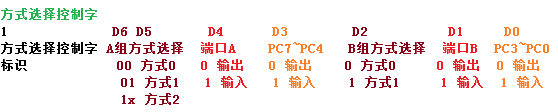

# 并行通信接口8255

1.端口选择：
 A1A0 = 00 A端口，01 B端口，10 C端口，11 控制口

2.方式选择控制字：
 
 方式选择控制字最高位固定为1。
 方式0：基本的输入/输出方式。
 方式1：选通的输入/输出方式。
 方式2：双向传输方式。只有端口A能工作在方式2。
 在使用中，端口A和端口B常常作为独立的输入/输出端口，端口C则配合端口A和端口B工作，为这两个端口的输入/输出传输提供控制信号和状态信号。
 
 题目：
 8255A的A组工作于方式2，B组工作于方式1，B口输入，设计工作方式选择控制字为11000110。
 设8255A组工作方式1，B组工作方式1，A口输出，B口输入，设计工作方式选择字为10100110B。
 8255A中的工作方式控制字一定大于等于80H。
 8255A的PA口工作在方式1，PB口工作在方式1时，其PC端口部分引脚作联络，部分引脚作I/O。P226

3.端口C的置1/置0控制字
 D0：0 置0，1 置1
 D3 D2 D1：选择的位。

4.工作方式
 方式1-端口A-输入-PC4作为选通信号输入端/STBA，PC5作为输入缓冲区满信号输出端IBFA，PC3作为中断请求信号输出端INTRA。
 方式1-端口B-输入-PC2作为选通信号输入端/STBB，PC1作为输入缓冲区满信号输出端IBFB，PC0作为中断请求信号输出端INTRB。
 方式1-端口A-输出-PC7作为输出缓冲区满信号/OBFA输出端，PC6作为外设接收数据后的响应信号/ACKA，PC6作为中断请求信号INTRA的输出端。
 

 

当8255A工作在方式1输出时，通知外设将数据取走的信号是OBF。
8255A引脚信号WR=0,CS=0,A1=1,A0=1时，表示CPU向控制口送控制字。
8255的A口工作在方式1输入时，其中断允许控制位INTE的开/关是通过对PC4的按位置位/复位操作完成的。
8255A工作于方式1输出方式，A口/B口与外设之间的控制状态联络信号是PC7、PC6和PC1、PC2。
