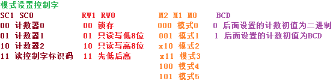

# 计数器8253

1.编程结构
 （1）一个8253芯片占用了4个端口地址，其中包含了3个独立的计数/定时器，每个计数/定时器均为16位，共用一个控制寄存器和状态寄存器。
 （2）输出锁存器OL用于锁存计数执行部件CE的内容，从而CPU可以进行读操作。
 （3）执行部件的初值与初值寄存器的值相同，计数范围为1~FFFFH。

2.控制字
 
 8253的3个计数通道的编程顺序是完全随机的，但必须先写入方式控制字。
 
 题目：8253-5工作于方式2，用BCD码计数，用1号计数器，只读高8位则控制字为：01100101B。
 
3.工作模式
 （1）初始值写入计数初值寄存器后，要经过一个时钟上升沿和一个下降沿，计数执行部件才开始计数。
 （2）在时钟脉冲的下降沿，计数器减1计数。
 （3）6种工作模式：
   方式0：电平触发；在初始化编程时，一旦写入控制字之后，OUT端为低电平；当控制信号GATE变为低电平时，计数会停止；计数结束产生中断。
   方式1：写入控制字后OUT为高电平；写入初值并受到触发后，OUT变为低电平；输出负脉冲的宽度等于计数初值N个CLK脉冲宽度。
   方式2：分频器。
   方式3：方波发生器。
   方式4：软件触发的选通信号发生器；电平触发。
   方式5：软件触发的选通信号发生器；上升沿触发。

8.	8253－5工作方式1和方式5时，门控信号为___A___触发。
 A．上升沿   B．下降沿	C．高电平	D．低电平
13.	在8253的6种工作方式中,能够自动重复工作的两种方式是_____B______。
A.方式1，方式2	B.方式2，方式3	
C.方式2，方式4	D.方式3，方式5
0.	与8253工作方式4输出波形相同的是__D___。
A．方式1	B．方式3	C．方式2	D．方式5

7.	启动8253的计数器开始或计数的方式有(  C   ) 。      
A．软件方式          B．硬件方式      
C．软件和硬件方式    D．门控信号  
	
9.	8253-5引脚CS、RD、WR、A1、A0为__C___时，表示对计数器2设置计数初值。
A．00010B	B．10010B   C．01010B	D．10011B

11.	对8253的定时与计数__C__
A．有两种不同的工作方式	B。定时只加时钟脉冲，不设计数值
C．实质相同	D。从各自的控制端口设置

12.	8253通道0工作于方式3，接入6MHZ的时钟，要求产生2400HZ的方波，则计数器的初值应为_____B____	
A.2000 	    B.2500 	C.3000	  D.4000

2
21.	8253工作在___D___时，OUT引脚能输出一个CLK周期宽度的负脉冲.
 A.方式0   B.方式1     C.方式3    D.方式4或方式5
22.	8253的门控信号为___D___触发  
A.一定为低电平  B.一定为高电平    C.一定为上升沿   D.可以高电平或上升沿

3.	计数/定时器的门控信号是由外部设备送来的，作为对时钟的控制信号。
4.	计数/定时器信号OUT输出高电平信号时，表明计数执行单元计数值减1，已等于0。
6.	计数/定时器8253内部计数器的执行部件，实际上是16位减法计数器，他的初始值是由程序提供。

7.	要使8253定时/计数器的OUT输出100HZ的方波，计数频率为100KHZ，则计数的初值应为1000。

8.	8253在进行计数时，实际上是对输出信号线上的信号进行计数。

9.	假设8253的CLK0接1.5MHz的时钟，欲使OUT0产生频率为300KHz的方波信号，则8253的计数值应为5，应选用的工作方式是模式3。

12.	8253芯片可采用硬件启动的方式是模式1、2、3、5。
13.	在8253的六种工作方式中，输出周期性信号的是模式1、2、3。
14.	在8253的六种工作方式中，由GATE的上升沿启动计数的是模式1、2、3、5。
16.	设8253芯片中某一计数器的口地址为40H，控制口地址为43H，计数频率为2MHz，当计数器为0时，产生中断信号。试计算，序列程序所决定的中断周期是32.7675ms。（65535/2000 = 32.7675）
MOV AL,00110110B 
OUT 43H,AL 
MOV AL,OFFH 
OUT 40H,AL 
OUT 40H,AL  
